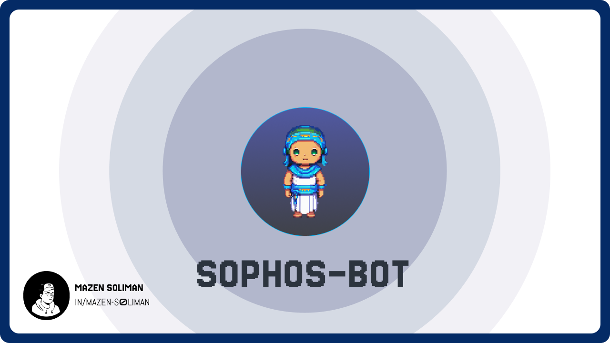
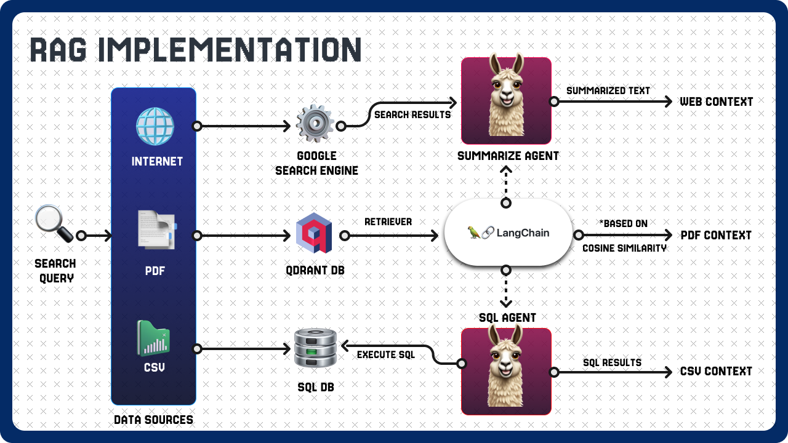
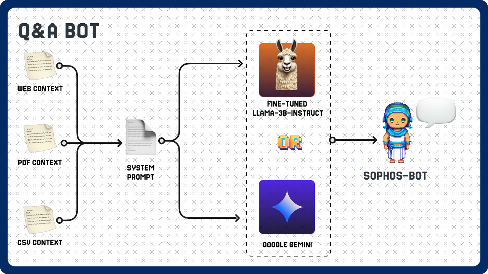
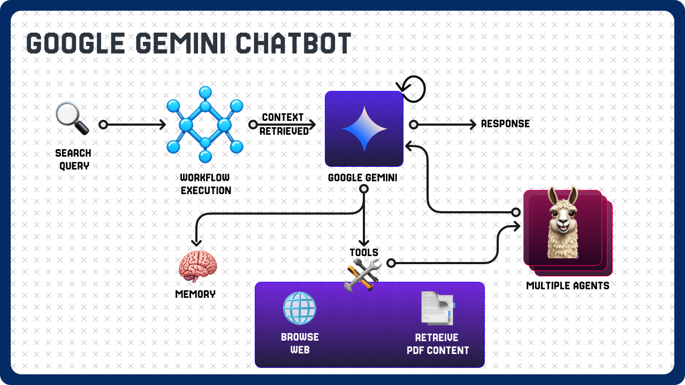

# NLP Milestone 3 – SOPHOS‑BOT

This repository contains the implementation and documentation for the SOPHOS‑BOT multi‑agent chatbot framework, developed as part of the CSEN1076 NLP and Information Retrieval course Milestone 3.

## Table of Contents

1. [Introduction](#introduction)
2. [Methdology](#diagrams)
3. [Usage](#usage)
4. [Contributors](#contributors)
---

## Introduction



SOPHOS‑BOT is a multi‑agent chatbot that leverages Retrieval‑Augmented Generation (RAG) to answer user queries by fetching and integrating information from web sources, PDF documents, and CSV files. Two core agents drive the system:

* **Google Gemini Agent**: Uses chain‑of‑thought prompting and a suite of tools (web browsing, PDF/CSV retrieval, summarization) to dynamically gather and reason over information.
* **Fine‑tuned LLaMA‑3B‑Instruct Agent**: Employs a LoRA‑based, 4‑bit quantized LLaMA model fine‑tuned on SQuAD for efficient extractive QA.

## Methodology
We used **LangGraph**, which enables the coordination of multiple agents across numerous steps of computation in a cyclic manner. So we implemented a workflow to extract the data from multiple resources and provide as a context to either our finetuned **LlaMa-3B-Instruct** model or **Gemini**.

### RAG Implementation
Our data sources consists of the following:
- **Internet:** by using Google search engine we retrieve content from various websites which we then use a Summarizing agent to summarize the content gathered from the internet and based on the question stated by the user.
- **PDF files:**  using Tesseract OCR to parse PDF files supplied by the user and store them in **Qdrant DB**, which is a vector database that allows for similarity search based on the input query.
- **CSV files:** by collecting the CSV files given by the user we store them in a SQL database for later retrieval by our SQL agent based on the user’s question.



### Question & Answer Chatbot
By collecting the PDF context, Web context and CSV context, we merge them into a single context within our system prompt that we provide to either our Finetuned **LlaMa-3BInstruct** or **Gemini** to generate a response to the user based on user’s question and recovered context.



### Gemini Chatbot
For our Gemini chatbot, we used Prompt Engineering techniques such as chain-ofthoughts to allow the model reason whether it have the necessary information to respond to user question it requires to use one of its tools to gather more information which depends on the complexity of the question. Also, we supply it with memory to recall user’s previous question and it’s answer. The chatbot is supported with various tools such as:
- **Generate Questions:** By using another agent to generate further questions based on the input to enhance its understanding of the question or the context.
- **Browse Web:** Based on the generated questions surf the web and retreive information from the internet.
- **Retrieve Data from PDF files:** Based on the generated questions retrieve data from PDF files.
- **Retrieve Data from CSV files:** Based on the generated questions retrieve data from CSV files.
- **Summarize:** Summarize retrieved data from either Web, PDF files and CSV files.



## Usage

1. **Launch the chatbot interface**:

   ```bash
   python src/server.py
   ```
2. **Interact** with either the Gemini agent or the fine‑tuned LLaMA agent via the web UI.
3. **Customize** data sources by uploading PDFs or CSVs via the UI which gets stored in `data/` folder.

---

*Prepared by Mazen Soliman and Mohamed Shamekh* 😊
